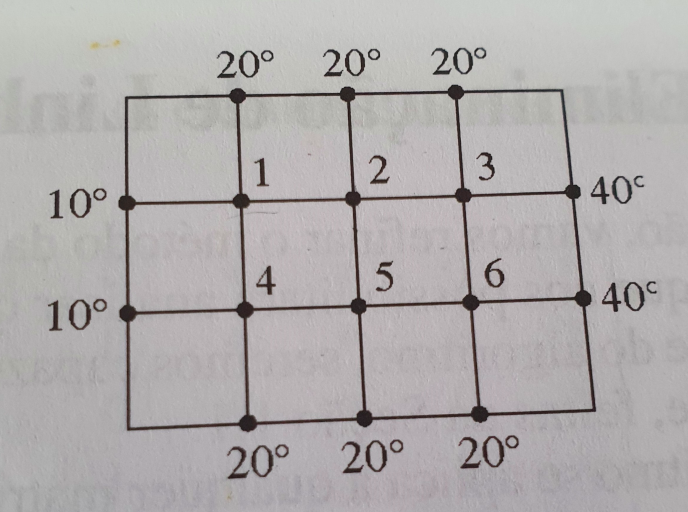

# Problema

Uma consideração importante no estudo de transferência de calor é a de determinar a distribuição de
temperatura assintótica de uma placa fina quando a temperatura em seu bordo é conhecida. Suponha que a placa na
Figura 2 represente uma seção transversal de uma barra de metal, com fluxo de calor desprezível na direção
perpendicular à placa. Sejam T1, T2, ... T6, as temperaturas em seis vértices interiores do reticulado da Figura 1. A temperatura num vértice é aproximadamente igual à média dos quatro vértices vizinhos mais próximos - à esquerda, acima, à direita e abaixo. Por exemplo,

<!-- $$ T_1 = \frac{(10+20+T_2+T_4)}{4} \hspace{0.5cm} \text{ou} \hspace{0.5cm} 4T_1-T_2-T_4=30  $$ -->

<!-- T_1%20%3D%20%5Cfrac%7B%2810%2B20%2BT_2%2BT_4%29%7D%7B4%7D%20%5Chspace%7B0.5cm%7D%20%5Ctext%7Bou%7D%20%5Chspace%7B0.5cm%7D%204T_1-T_2-T_4%3D30%20 -->

| </img> |
|:--:|
|*Figura 1. Temperatura em seis vértices interiores do reticulado*|

**a)** Escreva um sistema de seis equações cuja solução forneça estimativas para as temperaturas 

**b)** Resolva o sistema linear obtido em **a)** pelo método de fatoração LU

Fonte: Lay, D. C., Lay, S. R., McDonald, J. J. Álgebra Linear e Suas Aplicações. Rio de Janeiro: LTC, 2000.
